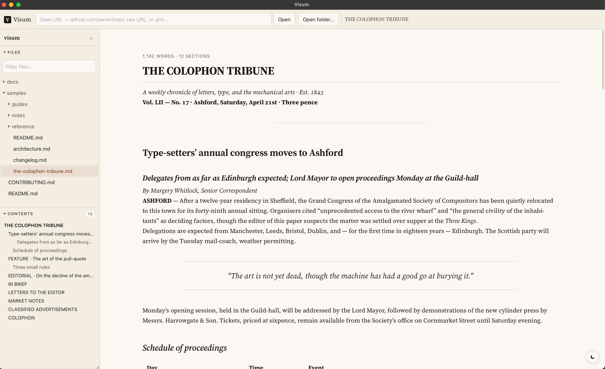

# Visum



> **Visum** /ˈwiː.sũː/ · Latin, neuter past participle of *vidēre*, "to see."
> *A thing seen; a sight, a view, a vision.*

Newsprint-style markdown reader that runs locally.

## Download

Get the latest build for your platform from
[GitHub Releases](https://github.com/ipcrm/visum/releases):

- **macOS** — `.dmg` (Apple Silicon and Intel builds)
- **Windows** — `.msi` installer or portable `.exe`
- **Linux** — `.AppImage` or `.deb`

Builds are unsigned; on macOS, right-click the app the first time and choose
**Open** to bypass Gatekeeper.

## Documentation

Full docs at [ipcrm.github.io/visum](https://ipcrm.github.io/visum).

## Try it

Clone the repo and open the bundled demo content:

```sh
git clone https://github.com/ipcrm/visum
```

In Visum, press <kbd>⌘O</kbd> and pick the repo's
[`samples/`](./samples) directory. It contains a small fictional project
that exercises every rendering feature — GFM tables and task lists, alerts,
KaTeX math, Mermaid diagrams, syntax highlighting across several languages,
footnotes, nested folders, relative image paths, raw HTML images, a
deliberately broken image to show the fallback chip, and an external image
to exercise the load-prompt.

## Features

- GitHub-flavored markdown: tables, task lists, strikethrough, footnotes,
  autolinks, `[!NOTE]` alerts, emoji shortcodes
- Math (KaTeX) and Mermaid diagrams, lazy-loaded
- Folder mode with file tree, filter, live watcher, and a heading-based table
  of contents
- Remote mode for GitHub repos, gists, and any public markdown URL — relative
  links resolve through the raw content base
- Tabs for multiple folders / documents at once, with a searchable overflow
  picker
- Find in document (⌘F) and full-text search across a folder (⌘⇧F)
- Bookmarks, recents, and per-document reading-position memory
- Print / save as PDF via the browser's native print pipeline
- Per-image and per-link prompting before touching the network; trusted hosts
  persist
- Newsprint typography: Source Serif 4, ragged-right, hyphenation, dark mode,
  drag-adjustable column width

## Tech

Tauri 2 (Rust) · Svelte 5 · pulldown-cmark · ammonia · syntect · tantivy ·
reqwest · notify · Vite · pnpm.

## Contributing

See [CONTRIBUTING.md](CONTRIBUTING.md).
