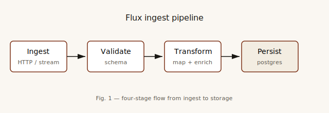
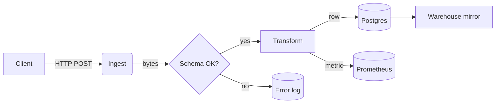
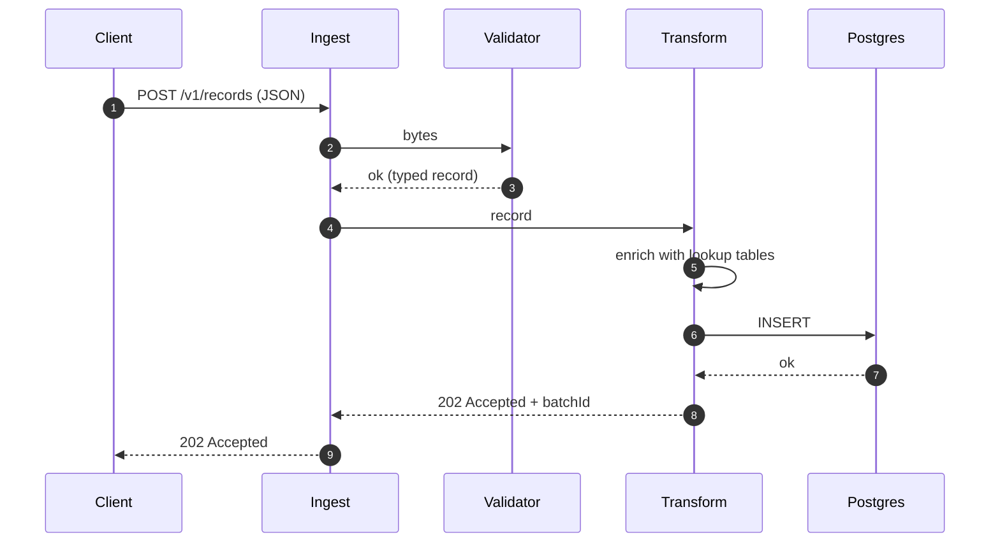
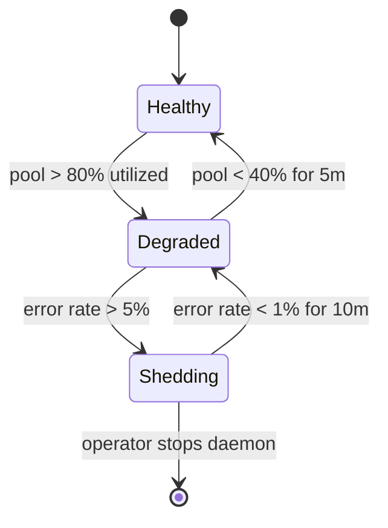

# Architecture

Flux is designed around a three-stage pipeline. Records enter at the left,
exit at the right, and nobody has ever seen this system in real life.

## High-level flow

## Sequence — a successful ingest

## Capacity math

For $n$ worker threads with pool size $p$ and average statement latency
$\bar{t}$ seconds, the sustainable throughput ceiling is approximately

$$
Q = \frac{n \cdot p}{\bar{t}}
$$

For $n = 8$, $p = 16$, $\bar{t} = 0.012$ s, that's

$$
Q \approx \frac{8 \cdot 16}{0.012} \approx 10{,}666 \text{ rec/s}
$$

i.e. the classic "plenty, until something isn't". Prod reality is always
bounded by something else (the network, the TLS handshake, the database's
checkpoint behavior, Mercury).

## Failure domains

## Trust boundaries

Everything outside the daemon process is untrusted. That includes:

- the HTTP clients
- the database (bad migrations happen)
- the metrics collector (malicious labels → cardinality explosion)
- the humans — especially the humans

Inside the daemon, the only thing we trust is the config file, and even then
we schema-validate it on startup.

## See also

- [Configuration](./guides/configuration.md)
- [API](./reference/api.md)
- [Changelog](./changelog.md)
