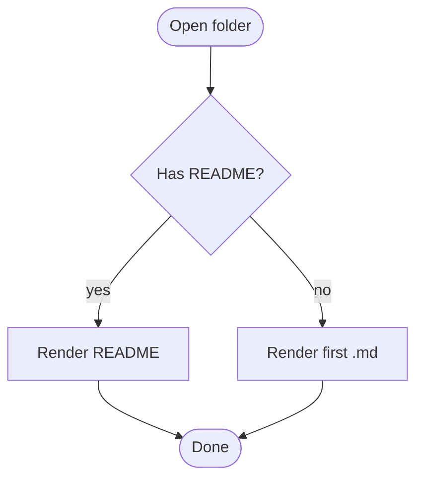
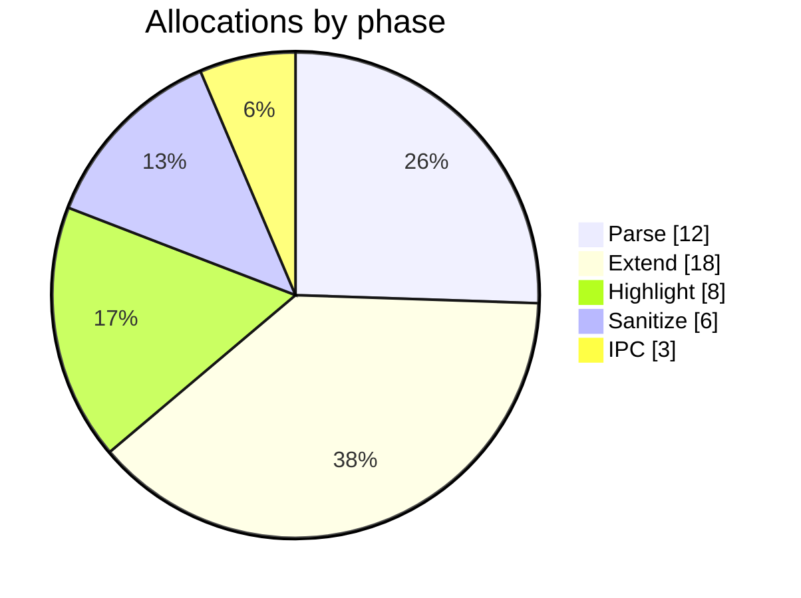
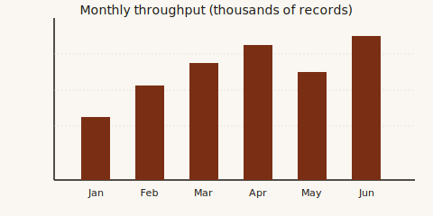

# Random thoughts

A kitchen sink: every rendering feature Visum supports, crammed into one
document so you can verify them at a glance.

## Emoji

Good morning :wave:. :sparkles: :rocket: :coffee: :brain: :newspaper:. Unknown
ones like `:notarealemoji:` should pass through untouched.

> Inside code, `:smile:` should *not* be expanded: `:smile:` still says the
> literal thing.

## Alerts

> [!NOTE]
> A plain note. Whitespace around the text should render cleanly.

> [!TIP]
> A useful tip, often about something we don't care about.

> [!IMPORTANT]
> Ignore at your peril.

> [!WARNING]
> Floor is lava. Don't step on the floor.

> [!CAUTION]
> This is dangerous advice. Do the opposite.

Plain blockquote, for contrast:

> The past is a foreign country; they do things differently there.

## Math

Inline: $a^2 + b^2 = c^2$.

Display:

$$
\int_0^{\infty} e^{-x^2}\,dx = \frac{\sqrt{\pi}}{2}
$$

$$
\sum_{k=0}^{n} \binom{n}{k} = 2^n
$$

## Mermaid





## Tables

A basic table, numeric column right-aligned:

| Metric | Prev | Now | Δ |
|:---|---:|---:|---:|
| Throughput (rec/s) | 4 120 | 10 640 | +158% |
| p99 latency (ms) | 82 | 27 | −67% |
| Memory peak (MB) | 412 | 196 | −52% |

A wide table:

| Column A | Column B | Column C | Column D | Column E | Column F |
|---|---|---|---|---|---|
| The quick | brown fox | jumps over | the lazy | dog. Three | times. |
| Pack my | box with | five dozen | liquor jugs | and a | napkin. |

## Task list

- [x] Draft the schema
- [x] Wire the validator
- [ ] Write the migration[^mig]
- [ ] Open a pull request
- [ ] Close it again, ashamed

[^mig]: Migrations are awful; there's no getting around it. Even in a
  fictional project we can acknowledge this honestly.

## Syntax highlighting

### Rust

```rust
use std::collections::HashMap;

/// Count occurrences of each word in `text`.
fn word_counts(text: &str) -> HashMap<String, usize> {
    let mut counts = HashMap::new();
    for word in text.split_whitespace() {
        *counts.entry(word.to_lowercase()).or_insert(0) += 1;
    }
    counts
}

fn main() {
    let text = "Read markdown like it's print. Read it well.";
    for (word, n) in word_counts(text) {
        println!("{word:>10}  {n}");
    }
}
```

### TypeScript

```ts
type Resolution =
  | { kind: "internal"; source: string }
  | { kind: "external"; url: string }
  | { kind: "anchor";   fragment: string };

function classify(href: string): Resolution {
  if (href.startsWith("#"))      return { kind: "anchor",   fragment: href.slice(1) };
  if (/^https?:\/\//.test(href)) return { kind: "external", url: href };
  return { kind: "internal", source: href };
}
```

### Shell

```bash
#!/usr/bin/env bash
set -euo pipefail

for f in **/*.md; do
  wc -w "$f" | awk '{ printf "%6d  %s\n", $1, $2 }'
done | sort -nr | head
```

### SQL

```sql
SELECT
  source,
  date_trunc('hour', captured) AS hour,
  count(*)                     AS n,
  avg((payload->>'temp')::numeric) AS avg_temp
FROM records
WHERE captured >= now() - interval '24 hours'
GROUP BY 1, 2
ORDER BY hour DESC;
```

## Inline formatting

**bold**, *italic*, ***bold italic***, ~~strikethrough~~, `code`, [link to
the README](../README.md), [link to the API docs](../reference/api.md),
[external link](https://example.com), <https://example.com/autolink>.

## Nested list with a mix

1. Top-level numbered
   - nested unordered
     - deeper
       - deeper still
   - back out
2. Item two
   - [x] with a checkbox
   - [ ] another one

## HTML passthrough

<details>
<summary>A collapsible section</summary>

Inside a `<details>` element. Can contain **formatted** markdown,
`inline code`, and — importantly — relative images:

<p align="center"></p>

</details>

A centered image via raw HTML (this is the common README pattern the raw-img
rewriter handles):

<p align="center">
  
</p>

## Broken image fallback

This points at a file that doesn't exist. Visum should show a ⚠ chip with
the full path, not a silent broken-image icon:


## External image (should prompt)


## Footnotes

Inline footnote reference[^one], and another[^two]. Both appear at the
bottom of the document as pulldown-cmark renders them.

[^one]: First footnote. Pure narrative.
[^two]: Second footnote. Contains `code`, *italic*, and a [link](#emoji).

## Horizontal rule

---

End of kitchen sink. See [nested file](./deep/nested.md) for tree-depth
testing.
